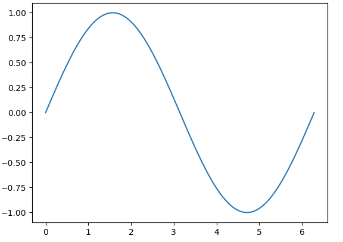

# try-PyScript
PyScriptお試しリポジトリ

PyScriptを用いてグラフを描画
- numpy
- matplotlib

</img>

### 参考
https://miyashinblog.com/pyscript/
https://qiita.com/Morio/items/d75159bac916174e7654

### メモ
まだ試作段階なため実用的ではまだない 
デバッグ方法が無い気がするためプログラム作成が困難 
起動が遅い 
